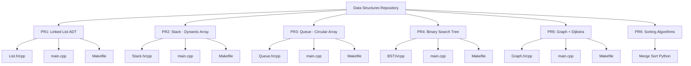
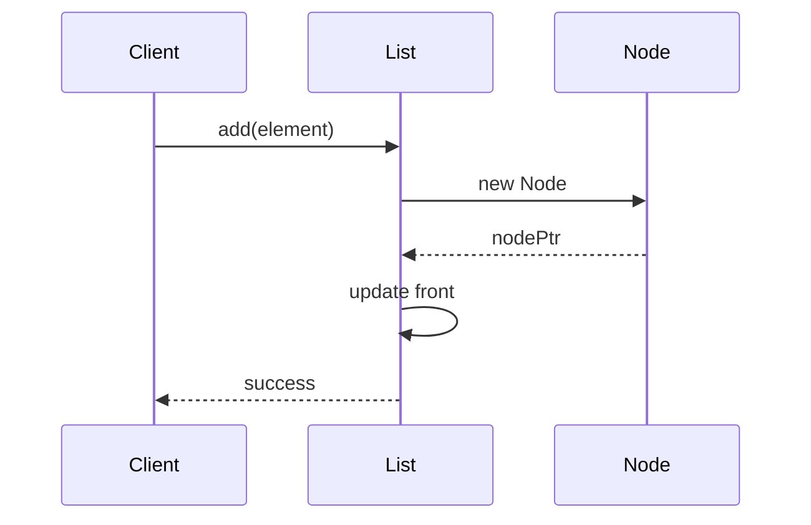
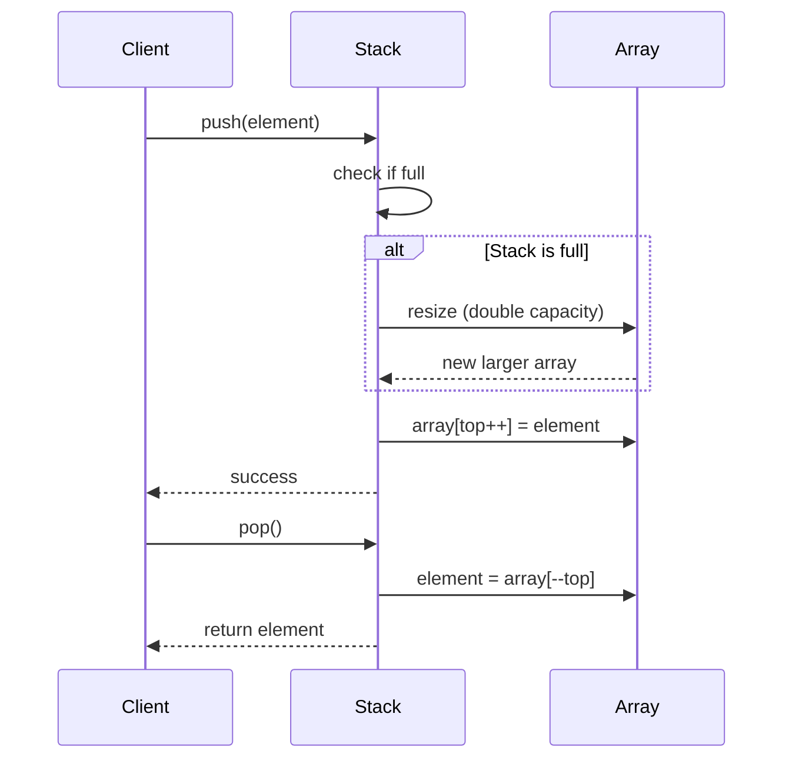
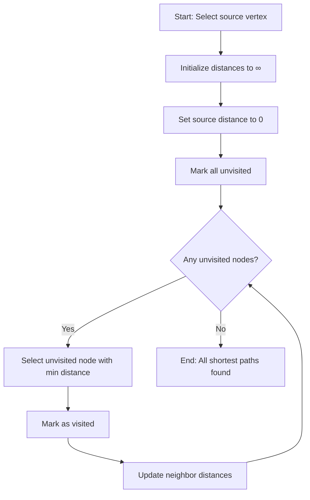
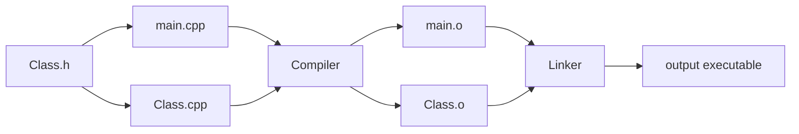

# Architecture Overview

This document describes the system architecture, design patterns, and implementation details of the Data Structures repository.

## Table of Contents

- [High-Level Overview](#high-level-overview)
- [Project Structure](#project-structure)
- [Module Descriptions](#module-descriptions)
- [Design Patterns](#design-patterns)
- [Data Flow](#data-flow)
- [Memory Management](#memory-management)

## High-Level Overview

This repository is organized as six independent projects (PR1-PR6), each implementing a specific data structure or algorithm. The projects are designed to be self-contained with minimal dependencies, following academic documentation standards.



## Project Structure

Each C++ project follows a consistent three-file architecture:

### Standard Project Layout

```
PRX-ProjectName/
├── ClassName.h          # Public interface (ADT specification)
├── ClassName.cpp        # Implementation details
├── main.cpp             # Test driver and usage examples
├── Makefile             # Build automation
└── Assignment X.pdf     # Original requirements
```

### File Responsibilities

#### Header Files (.h)
- **Purpose:** Define the public interface (Abstract Data Type)
- **Contents:**
  - Type definitions (`typedef Element`)
  - Class declaration
  - Public method declarations with documentation
  - Private member declarations (no documentation)
- **Example:** [List.h](../PR1-Abstract-Data-Type/List.h)

#### Implementation Files (.cpp)
- **Purpose:** Implement all class methods
- **Contents:**
  - Function definitions
  - Private helper functions
  - Algorithm implementations
- **Example:** [List.cpp](../PR1-Abstract-Data-Type/List.cpp)

#### Main Driver Files (main.cpp)
- **Purpose:** Demonstrate usage and test functionality
- **Contents:**
  - Test cases
  - Usage examples
  - Output demonstrations
- **Example:** [main.cpp](../PR1-Abstract-Data-Type/main.cpp)

## Module Descriptions

### PR1: Linked List ADT

**Location:** `PR1-Abstract-Data-Type/`

**Architecture:**
```
┌─────────────┐
│   List      │
│   ┌──────┐  │
│   │ Node │──┼──> Node ──> Node ──> NULL
│   └──────┘  │
│   front*    │
└─────────────┘
```

**Key Components:**
- **List class:** Manages the linked list
- **Node struct:** Contains element and next pointer (private)
- **Element type:** `float` (configurable via typedef)

**Operations:** add, remove, view, size, clear

**Memory Model:** Dynamic allocation using linked nodes

---

### PR2: Stack (Dynamic Array)

**Location:** `PR2-Stack/`

**Architecture:**
```
┌──────────────────────────┐
│        Stack             │
│  ┌──────────────────┐    │
│  │ stackArray*      │────┼──> [elem0][elem1][elem2][...]
│  │ top = 2          │    │
│  │ STACK_SIZE = 10  │    │
│  └──────────────────┘    │
└──────────────────────────┘
```

**Key Components:**
- **Dynamic array:** Automatically resizes when full (doubles capacity)
- **Top index:** Points to the next available position
- **Element type:** `string`

**Operations:** push, pop, peek, view, copy

**Memory Model:** Dynamic array with automatic resizing

**Resize Strategy:**
```cpp
void Stack::resize() {
    // Double the capacity when full
    STACK_SIZE *= 2;
    // Allocate new array and copy elements
}
```

---

### PR3: Queue (Circular Array)

**Location:** `PR3-Queue/`

**Architecture:**
```
Circular Array (size = 5):
  ┌───┬───┬───┬───┬───┐
  │ 0 │ 1 │ 2 │ 3 │ 4 │
  └───┴───┴───┴───┴───┘
    ↑               ↑
   head            tail
```

**Key Components:**
- **Circular array:** Fixed-size array with wraparound
- **Head/Tail pointers:** Track front and rear
- **Element type:** `int`

**Operations:** enqueue, dequeue, view

**Memory Model:** Fixed-size array with circular indexing

**Circular Logic:**
```cpp
// Enqueue: tail = (tail + 1) % QUEUE_SIZE
// Dequeue: head = (head + 1) % QUEUE_SIZE
```

---

### PR4: Binary Search Tree

**Location:** `PR4-BST/PR4_BST/`

**Architecture:**
```
         5
       /   \
      3     7
     / \   / \
    1   4 6   9
```

**Key Components:**
- **BST class:** Manages the tree
- **Node struct:** Contains element, left, and right pointers
- **Element type:** `int`

**Operations:**
- **Modification:** insert, remove
- **Search:** search
- **Traversal:** preorderView, inorderView, postorderView

**Memory Model:** Dynamically allocated binary tree nodes

**Traversal Orders:**
- **Preorder:** Root → Left → Right (top-down)
- **Inorder:** Left → Root → Right (sorted order)
- **Postorder:** Left → Right → Root (bottom-up)

---

### PR5: Graph with Dijkstra's Algorithm

**Location:** `PR5-Graph/PR5_Graph/`

**Architecture:**
```
Graph (Adjacency Matrix):
     A   B   C   D
  A [0   5  ∞   10]
  B [5   0   3   ∞]
  C [∞   3   0   1]
  D [10  ∞   1   0]
```

**Key Components:**
- **Adjacency matrix:** 2D array storing edge costs
- **Distance array:** Shortest distances from source
- **Visited array:** Tracks processed vertices
- **Element type:** `unsigned short`

**Operations:** dijkstra (shortest path algorithm)

**Memory Model:** Static 2D array (max 15 nodes)

**Algorithm Flow:**
1. Initialize all distances to infinity except source (0)
2. Mark all nodes as unvisited
3. For each iteration:
   - Select unvisited node with minimum distance
   - Mark as visited
   - Update distances to neighbors

---

### PR6: Sorting Algorithms

**Location:** `PR6-Sorting Numbers/`

**Implementation:** Python-based merge sort

**Architecture:**
```
Divide and Conquer:
[43, 12, 32, 20, 14, 39, 21, 28, 48]
           ↓ Split
[43, 12, 32, 20] [14, 39, 21, 28, 48]
           ↓ Split recursively
[43] [12] [32] [20] [14] [39] [21] [28] [48]
           ↓ Merge sorted pairs
[12, 43] [20, 32] [14, 39] [21, 28, 48]
           ↓ Continue merging
[12, 14, 20, 21, 28, 32, 39, 43, 48]
```

**Algorithm:** Merge Sort (O(n log n))

## Design Patterns

### Abstract Data Type (ADT) Pattern

All C++ projects follow the ADT pattern:

```cpp
class DataStructure {
public:
    // Public interface - documented
    void operation();
    
private:
    // Implementation details - hidden
    void helperFunction();
    InternalType* data;
};
```

**Benefits:**
- Encapsulation: Hide implementation details
- Flexibility: Change internals without affecting users
- Clarity: Clear separation of interface and implementation

### Resource Acquisition Is Initialization (RAII)

All classes properly manage resources:

```cpp
class List {
public:
    List();              // Constructor: acquire resources
    List(const List&);   // Copy constructor: deep copy
    ~List();             // Destructor: release resources
private:
    NodePtr front;       // Owned resource
};
```

### Iterator Pattern (Implicit)

Traversal methods provide iteration capability:

```cpp
// BST traversal is implemented via callbacks
void inorderView() const;  // Visits all nodes in order
```

## Data Flow

### Insert Operation (List)



### Push/Pop Operation (Stack)



### Dijkstra's Algorithm (Graph)



## Memory Management

### Dynamic Allocation Patterns

#### Linked Structures (List, BST)

```cpp
// Allocation
NodePtr newNode = new Node;
newNode->element = value;
newNode->next = nullptr;

// Deallocation (destructor)
while (front != nullptr) {
    NodePtr temp = front;
    front = front->next;
    delete temp;  // Free memory
}
```

#### Dynamic Arrays (Stack)

```cpp
// Allocation
stackArray = new Element[STACK_SIZE];

// Reallocation (resize)
Element* newArray = new Element[newSize];
// Copy elements
delete[] stackArray;  // Free old array
stackArray = newArray;

// Deallocation (destructor)
delete[] stackArray;
```

#### Fixed Arrays (Queue)

```cpp
// Allocation (constructor initialization list)
Queue::Queue(int size) 
    : QUEUE_SIZE(size), 
      queueArray(new Element[size]),
      head(0), tail(0) 
{}

// Deallocation (destructor)
delete[] queueArray;
```

### Copy Operations

All classes implement deep copy:

```cpp
// Copy constructor pattern
List::List(const List& other) {
    // Deep copy all nodes
    NodePtr current = other.front;
    while (current != nullptr) {
        this->add(current->element);  // Create new nodes
        current = current->next;
    }
}
```

## Compilation and Linking

### Build Process



### Makefile Pattern

```makefile
# Compile and link in one step
output: main.o Class.o
	g++ -std=c++11 -o output main.o Class.o

# Compile source files to object files
main.o: main.cpp
	g++ -std=c++11 -c main.cpp

Class.o: Class.h Class.cpp
	g++ -std=c++11 -c Class.cpp

clean:
	rm output main.o Class.o
```

## Performance Characteristics

| Data Structure | Insert | Delete | Search | Space |
|----------------|--------|--------|--------|-------|
| List           | O(1)   | O(n)   | O(n)   | O(n)  |
| Stack          | O(1)*  | O(1)   | N/A    | O(n)  |
| Queue          | O(1)   | O(1)   | N/A    | O(n)  |
| BST            | O(log n)** | O(log n)** | O(log n)** | O(n) |
| Graph (Dijkstra)| N/A   | N/A    | O(V²)*** | O(V²)|

\* Amortized O(1) due to occasional resizing  
\*\* Average case; O(n) worst case for unbalanced tree  
\*\*\* Where V is number of vertices (using adjacency matrix)

## Thread Safety

**Note:** None of the implementations are thread-safe. All operations assume single-threaded access.

## Extension Points

### How to Add New Element Types

Change the typedef in the header file:

```cpp
// Before
typedef int Element;

// After (example: using custom struct)
struct Student {
    int id;
    string name;
};
typedef Student Element;
```

### How to Add New Operations

1. Declare in header file (public section)
2. Document with standard block comment
3. Implement in .cpp file
4. Add test case in main.cpp

---

*This architecture reflects the actual implementation as of the completion of Assignment 6 (Fall 2023).*
